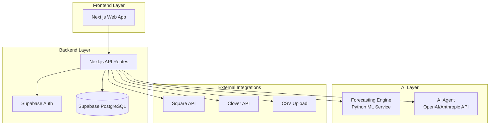

# Design Document

## Overview

The Smart Inventory Forecasting MVP is built as a modern web application using a hybrid AI architecture that combines machine learning forecasting with natural language processing. The system follows a microservices approach with a Next.js frontend, serverless backend functions, and specialized AI components for forecasting and explanation generation.

## Architecture

### High-Level Architecture



### Technology Stack

- **Frontend**: Next.js 14 with React, TypeScript, Tailwind CSS (responsive design for Requirements 6.1, 6.2)
- **Backend**: Next.js API Routes (serverless functions on Vercel for fast performance - Requirement 6.3)
- **Database**: Supabase PostgreSQL with real-time subscriptions (data storage - Requirement 1.6)
- **Authentication**: Supabase Auth (user authentication - Requirement 1.1)
- **Forecasting Engine**: Python microservice using scikit-learn, Prophet, or ARIMA (ML forecasting - Requirements 3.1, 3.2)
- **AI Agent**: OpenAI GPT-4 or Anthropic Claude API (natural language explanations - Requirement 4.2)
- **Deployment**: Vercel for frontend/API, Google Cloud Run for Python service
- **File Storage**: Supabase Storage for CSV uploads and generated PDFs
- **Performance**: Loading indicators and graceful degradation for slow connections (Requirement 6.6)

## Components and Interfaces

### 1. Authentication & User Management

**Component**: `AuthProvider` and `UserContext`
- Handles user registration, login, password reset using Supabase Auth (Requirement 1.1)
- Manages user sessions and maintains consistency across devices (Requirement 6.5)
- Tracks onboarding completion status for POS connection wizard

**Interface**:
```typescript
interface User {
  id: string;
  email: string;
  store_name: string;
  created_at: string;
  onboarding_completed: boolean;
}
```

**Design Rationale**: Supabase Auth provides enterprise-grade authentication with minimal setup, allowing focus on core inventory features rather than authentication infrastructure.

### 2. POS Integration Layer

**Component**: `POSConnectorService`
- Displays connection wizard after onboarding completion (Requirement 1.2)
- Syncs inventory and historical sales data via Square API (Requirement 1.3)
- Syncs inventory and historical sales data via Clover API (Requirement 1.4)
- Parses and imports CSV files using standardized template (Requirement 1.5)
- Handles API authentication, rate limiting, and error recovery
- Standardizes data format across different POS systems for consistent processing

**Interfaces**:
```typescript
interface POSConnection {
  id: string;
  user_id: string;
  pos_type: 'square' | 'clover' | 'manual';
  credentials: Record<string, string>;
  last_sync: string;
  status: 'active' | 'error' | 'pending';
}

interface SalesData {
  sku: string;
  item_name: string;
  quantity_sold: number;
  sale_date: string;
  unit_price: number;
  supplier_id?: string;
}

interface InventoryItem {
  sku: string;
  name: string;
  current_stock: number;
  supplier_id?: string;
  lead_time_days?: number;
  cost: number;
}
```

**Design Rationale**: Supporting multiple POS systems with a unified interface allows broader market reach while maintaining code simplicity. CSV upload provides fallback for unsupported POS systems.

### 3. Data Cleanup Engine

**Component**: `DataCleanupService`
- Scans for duplicate item names and flags them for review (Requirement 2.1)
- Identifies items missing supplier information (Requirement 2.2)
- Identifies items with no sales history (Requirement 2.3)
- Displays cleanup report showing all found issues (Requirement 2.4)
- Provides tools to merge duplicates and assign suppliers (Requirement 2.5)
- Blocks forecasting until cleanup issues are resolved (Requirement 2.6)

**Interface**:
```typescript
interface CleanupIssue {
  id: string;
  type: 'duplicate' | 'missing_supplier' | 'no_sales_history';
  severity: 'high' | 'medium' | 'low';
  affected_items: string[];
  suggested_action: string;
  resolved: boolean;
}

interface CleanupReport {
  total_issues: number;
  issues_by_type: Record<string, number>;
  completion_percentage: number;
  blocking_forecasting: boolean;
}
```

**Design Rationale**: Data quality is critical for accurate forecasting. By requiring cleanup before forecasting, we ensure reliable predictions and build user trust in the system's recommendations.

### 4. Forecasting Engine

**Component**: `ForecastingService` (Python microservice)
- Generates 7-day demand forecasts using ML models when historical data is available (Requirement 3.1)
- Uses ARIMA or Prophet statistical models for time-series analysis (Requirement 3.2)
- Identifies seasonal trends and sales velocity patterns (Requirement 3.3)
- Factors in supplier lead times when calculating recommendations (Requirement 3.4)
- Outputs structured data including SKU, forecast quantity, current stock, and recommended order quantity (Requirement 3.5)
- Notifies users when insufficient historical data exists and suggests minimum requirements (Requirement 3.6)

**API Interface**:
```python
@app.post("/forecast")
async def generate_forecast(request: ForecastRequest) -> ForecastResponse:
    """
    Generate demand forecast for specified items
    """
    pass

class ForecastRequest(BaseModel):
    user_id: str
    items: List[str]  # SKUs to forecast
    forecast_days: int = 7
    min_data_points: int = 14  # Minimum historical data required

class ForecastResponse(BaseModel):
    forecasts: List[ItemForecast]
    insufficient_data_items: List[str]
    data_quality_warnings: List[str]

class ItemForecast(BaseModel):
    sku: str
    current_stock: int
    forecast_7_day: int
    recommended_order: int
    confidence_score: float
    trend: str  # 'increasing', 'decreasing', 'stable'
    seasonality_detected: bool
    lead_time_factored: int
```

**Design Rationale**: Python microservice allows use of specialized ML libraries while keeping the main application lightweight. ARIMA and Prophet are proven models for retail forecasting with good handling of seasonality.

### 5. AI Agent (LLM Integration)

**Component**: `AIAgentService`
- Displays "Today's To-Do List" dashboard on user login (Requirement 4.1)
- Uses LLM to convert forecast data into human-readable explanations (Requirement 4.2)
- Explains reordering reasoning with context (e.g., "Sales 30% higher than average this week") (Requirement 4.3)
- Provides specific timeline warnings for stockout risks (e.g., "risk of stockout in 2 days") (Requirement 4.4)
- Prioritizes recommendations by urgency and business impact (Requirement 4.5)
- Displays positive confirmation when no actions are needed (Requirement 4.6)

**Interface**:
```typescript
interface AIRecommendation {
  sku: string;
  priority: 'urgent' | 'high' | 'medium' | 'low';
  action: string;
  explanation: string;
  confidence: number;
  timeline_warning?: string;
  reasoning_context: string;
}

interface DailyTodoList {
  date: string;
  urgent_actions: AIRecommendation[];
  routine_actions: AIRecommendation[];
  positive_status?: string;
  total_action_count: number;
}
```

**Design Rationale**: LLM integration transforms complex data into actionable insights that non-technical users can understand and act upon immediately, reducing decision paralysis.

### 6. Dashboard & UI Components

**Components**:
- `DashboardHome`: Main landing page with today's recommendations (Requirement 4.1)
- `OnboardingWizard`: Step-by-step POS connection setup (Requirement 1.2)
- `DataCleanupScreen`: Interactive data quality review with merge and assignment tools (Requirements 2.4, 2.5)
- `ReorderList`: Purchase order generation interface grouped by supplier (Requirement 5.1)
- `InventoryOverview`: Current stock levels and trends
- `ResponsiveLayout`: Ensures full functionality across desktop, tablet, and mobile (Requirements 6.1, 6.2)

**Design Rationale**: Component-based architecture allows for responsive design that maintains functionality across all device sizes while providing touch-optimized interfaces for mobile users.

### 7. Purchase Order Generation

**Component**: `POGenerationService`
- Groups reorder recommendations by assigned supplier (Requirement 5.1)
- Creates clean, professional PDF documents (Requirement 5.2)
- Provides pre-written email drafts with supplier contact information (Requirement 5.3)
- Includes item details, quantities, and supplier information when generating POs (Requirement 5.4)
- Allows one-click email sending via mailto links (Requirement 5.5)
- Prompts user to complete supplier details if missing before PO generation (Requirement 5.6)

**Interface**:
```typescript
interface PurchaseOrder {
  id: string;
  supplier_id: string;
  supplier_name: string;
  supplier_email?: string;
  items: POLineItem[];
  total_amount: number;
  generated_at: string;
  status: 'draft' | 'sent' | 'confirmed';
  email_draft?: string;
}

interface POLineItem {
  sku: string;
  name: string;
  quantity: number;
  unit_cost: number;
  line_total: number;
}

interface SupplierValidation {
  supplier_id: string;
  has_contact_info: boolean;
  missing_fields: string[];
  can_generate_po: boolean;
}
```

**Design Rationale**: Automated PO generation with supplier grouping reduces manual work while maintaining professional communication standards. Email integration streamlines the ordering process.

## Data Models

### Database Schema

```sql
-- Users and authentication handled by Supabase Auth

-- Store configuration
CREATE TABLE stores (
  id UUID PRIMARY KEY DEFAULT gen_random_uuid(),
  user_id UUID REFERENCES auth.users(id),
  name TEXT NOT NULL,
  address TEXT,
  created_at TIMESTAMP DEFAULT NOW()
);

-- POS connections
CREATE TABLE pos_connections (
  id UUID PRIMARY KEY DEFAULT gen_random_uuid(),
  user_id UUID REFERENCES auth.users(id),
  pos_type TEXT NOT NULL,
  credentials JSONB,
  last_sync TIMESTAMP,
  status TEXT DEFAULT 'pending',
  created_at TIMESTAMP DEFAULT NOW()
);

-- Inventory items
CREATE TABLE inventory_items (
  id UUID PRIMARY KEY DEFAULT gen_random_uuid(),
  user_id UUID REFERENCES auth.users(id),
  sku TEXT NOT NULL,
  name TEXT NOT NULL,
  current_stock INTEGER DEFAULT 0,
  supplier_id UUID REFERENCES suppliers(id),
  lead_time_days INTEGER,
  unit_cost DECIMAL(10,2),
  created_at TIMESTAMP DEFAULT NOW(),
  UNIQUE(user_id, sku)
);

-- Sales history
CREATE TABLE sales_data (
  id UUID PRIMARY KEY DEFAULT gen_random_uuid(),
  user_id UUID REFERENCES auth.users(id),
  sku TEXT NOT NULL,
  quantity_sold INTEGER NOT NULL,
  sale_date DATE NOT NULL,
  unit_price DECIMAL(10,2),
  created_at TIMESTAMP DEFAULT NOW()
);

-- Suppliers
CREATE TABLE suppliers (
  id UUID PRIMARY KEY DEFAULT gen_random_uuid(),
  user_id UUID REFERENCES auth.users(id),
  name TEXT NOT NULL,
  contact_email TEXT,
  contact_phone TEXT,
  lead_time_days INTEGER DEFAULT 7,
  created_at TIMESTAMP DEFAULT NOW()
);

-- Forecasts
CREATE TABLE forecasts (
  id UUID PRIMARY KEY DEFAULT gen_random_uuid(),
  user_id UUID REFERENCES auth.users(id),
  sku TEXT NOT NULL,
  forecast_date DATE NOT NULL,
  forecast_quantity INTEGER NOT NULL,
  confidence_score DECIMAL(3,2),
  model_used TEXT,
  created_at TIMESTAMP DEFAULT NOW()
);

-- Data cleanup issues
CREATE TABLE cleanup_issues (
  id UUID PRIMARY KEY DEFAULT gen_random_uuid(),
  user_id UUID REFERENCES auth.users(id),
  issue_type TEXT NOT NULL,
  severity TEXT NOT NULL,
  affected_items JSONB,
  suggested_action TEXT,
  resolved BOOLEAN DEFAULT FALSE,
  created_at TIMESTAMP DEFAULT NOW()
);
```

## Error Handling

### API Error Responses
- Standardized error format with error codes and user-friendly messages
- Graceful degradation when external APIs are unavailable
- Retry logic with exponential backoff for transient failures

### Data Validation
- Input validation at API boundaries using Zod schemas
- Database constraints to ensure data integrity
- File upload validation for CSV imports

### User Experience
- Loading states for all async operations with performance indicators (Requirement 6.6)
- Offline detection and appropriate messaging about connectivity requirements (Requirement 6.4)
- Error boundaries to prevent application crashes
- Touch-optimized interface for mobile devices (Requirement 6.2)
- Session consistency across device switches (Requirement 6.5)

## Testing Strategy

### Unit Testing
- **Frontend**: Jest + React Testing Library for component testing
- **Backend**: Jest for API route testing with mocked dependencies
- **Forecasting Engine**: pytest for ML model validation

### Integration Testing
- API integration tests using Supertest
- Database integration tests with test database
- POS API integration tests with sandbox environments

### End-to-End Testing
- Playwright for critical user journeys
- Automated testing of onboarding flow
- Purchase order generation workflow testing

### Performance Testing
- Load testing for forecasting engine with large datasets
- API response time monitoring
- Database query optimization validation

### Security Testing
- Authentication flow testing
- API authorization testing
- Input sanitization validation
- PII data handling compliance